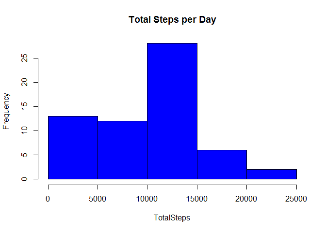
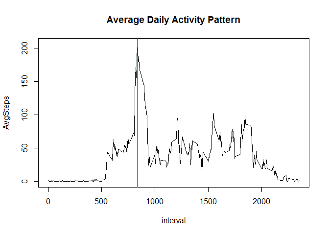
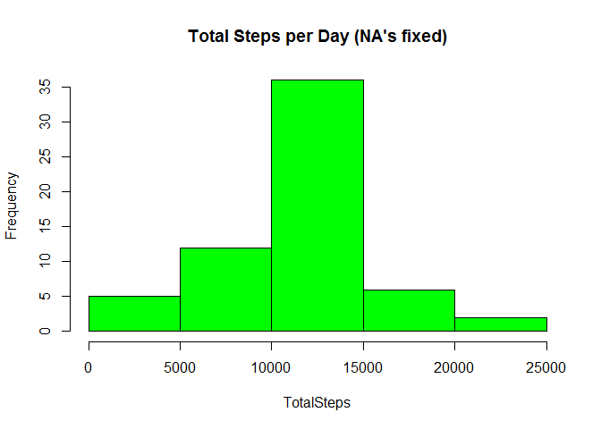
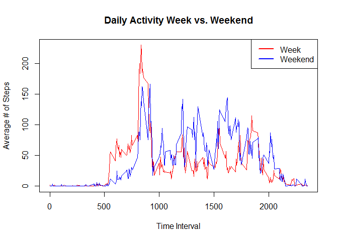

# Reproducible Research: Peer Assessment 1

```r
library(knitr)
library(ggplot2)
library(Hmisc)
```

```
## Loading required package: lattice
```

```
## Loading required package: survival
```

```
## Loading required package: Formula
```

```
## 
## Attaching package: 'Hmisc'
```

```
## The following objects are masked from 'package:base':
## 
##     format.pval, round.POSIXt, trunc.POSIXt, units
```

```r
library(data.table)
library(chron)
```


```r
opts_chunk$set(echo = TRUE)
```

## Loading and preprocessing the data
We are assuming that we have already downloaded the data and that it is unzipped,
waiting in a file names activity.csv in our working directory.  


```r
activity<-read.csv("activity.csv",header=TRUE)
activity$date<-as.Date(activity$date)
head(activity)
```

```
##   steps       date interval
## 1    NA 2012-10-01        0
## 2    NA 2012-10-01        5
## 3    NA 2012-10-01       10
## 4    NA 2012-10-01       15
## 5    NA 2012-10-01       20
## 6    NA 2012-10-01       25
```

## What is mean total number of steps taken per day?
Here we will total up the mean # of steps per day. 

```r
tSteps<-aggregate(activity$steps,by=list(activity$date),sum,na.rm=TRUE)
colnames(tSteps)<-c("StepDate","TotalSteps")

# Plot a histogram of the total number of steps per day.
with(tSteps,hist(TotalSteps,
                 main="Total Steps per Day",
                 col = "blue"),
                 xlim=range(10))
```

<!-- -->

#### Now we report the **mean** for each day

```r
mean(tSteps$TotalSteps,na.rm=TRUE)
```

```
## [1] 9354.23
```

#### Now we report the **median** for each day

```r
median(tSteps$TotalSteps,na.rm=TRUE)
```

```
## [1] 10395
```

## What is the average daily activity pattern?


```r
avgPattern<-aggregate(activity$steps,by=list(activity$interval),mean,na.rm=TRUE)
colnames(avgPattern)<-c("interval","AvgSteps")
head(avgPattern)
```

```
##   interval  AvgSteps
## 1        0 1.7169811
## 2        5 0.3396226
## 3       10 0.1320755
## 4       15 0.1509434
## 5       20 0.0754717
## 6       25 2.0943396
```
#### Now we plot the time series of the 5-minute interval (x-axis) and the average number of steps taken, averaged across all days

```r
with(avgPattern,plot(interval,AvgSteps,
                     type="l",
                     main="Average Daily Activity Pattern"))

# Find the row that has the maximum number of steps and then plot a vertical
# line at that time interval.
maxRow<-which.max(avgPattern$AvgSteps)
abline(v=avgPattern[maxRow,1],col="red")
```

<!-- -->

#### The 5-minute time interval that contains the **maximum** number of steps:

```r
print(avgPattern[maxRow,1])
```

```
## [1] 835
```

## Imputing missing values

#### 1. Calculate and report the total number of missing values in the dataset (i.e. the total number of rows with NAs)

```r
sum(!complete.cases(activity))
```

```
## [1] 2304
```

#### 2. Devise a strategy for filling in all of the missing values in the dataset. The strategy does not need to be sophisticated. For example, you could use the mean/median for that day, or the mean for that 5-minute interval, etc.

We will merge the avgPattern dataset with the larger activity set. This will give
us a column for AvgSteps in that time interval where NA is present. We can then
use this value to replace the NA.


```r
mrg<-merge(activity,avgPattern,by="interval")
mrg$steps[is.na(mrg$steps)]<-mrg$AvgSteps[is.na(mrg$steps)]
mrg<-mrg[order(mrg$date),]
```

#### 3. Create a new dataset that is equal to the original dataset but with the missing data filled in.

New dataset is called activity2 and these are the first few lines.

```r
activity2<-mrg[,c("steps","date","interval")]
head(activity2)
```

```
##         steps       date interval
## 1   1.7169811 2012-10-01        0
## 63  0.3396226 2012-10-01        5
## 128 0.1320755 2012-10-01       10
## 205 0.1509434 2012-10-01       15
## 264 0.0754717 2012-10-01       20
## 327 2.0943396 2012-10-01       25
```

#### 4. Make a histogram of the total number of steps taken each day and Calculate and report the mean and median total number of steps taken per day. Do these values differ from the estimates from the first part of the assignment? What is the impact of imputing missing data on the estimates of the total daily number of steps?


```r
tSteps2<-aggregate(activity2$steps,by=list(activity2$date),sum)
colnames(tSteps2)<-c("StepDate","TotalSteps")


with(tSteps2,hist(TotalSteps,
                 main="Total Steps per Day (NA's fixed)",
                 col = "green"),
                 xlim=range(10))
```

<!-- -->

#### Now we report the **mean** for each day

```r
mean(tSteps2$TotalSteps)
```

```
## [1] 10766.19
```

#### Now we report the **median** for each day

```r
median(tSteps2$TotalSteps)
```

```
## [1] 10766.19
```

So *YES* there are differences in the Total # of Daily Steps when we remove the NA's.  
The **mean** changes from 9354 to 10766 steps per day.  
The **median** changes from 10395 to 10766 steps per day.

## Are there differences in activity patterns between weekdays and weekends?


```r
# First separate the dates into weeks and weekends.
weekActivity<-activity2[!is.weekend(activity$date),]
weekendActivity<-activity2[is.weekend(activity$date),]

# Now we'll do the same average pattern we did before, but for each data set.
avgWeek<-aggregate(weekActivity$steps,by=list(weekActivity$interval),mean)
colnames(avgWeek)<-c("interval","AvgSteps")

avgWeekend<-aggregate(weekendActivity$steps,by=list(weekendActivity$interval),mean)
colnames(avgWeekend)<-c("interval","AvgSteps")

# Now we plot the 2 data sets.
plot(avgWeek$interval,avgWeek$AvgSteps,
     col="red",
     type="l",
     xlab="Time Interval",
     ylab="Average # of Steps",
     main="Daily Activity Week vs. Weekend")
lines(avgWeekend$interval,avgWeekend$AvgSteps,
      col="blue")
legend("topright",c("Week","Weekend"),col=c("red","blue"),lty=1,lwd=2)
```

<!-- -->

So clearly, yes, there is a difference in daily activity between the week and the weekend. Qualitatively, the week sees more morning activity than the weekend, which makes sense; we usually have to wake up and go to work during the week. The weekend also sees more activity in the evening hours as we go out and do stuff, as opposed to coming home from work and crashing during the week.

### Alternatively, by factor

```r
activity2$Week<-as.factor(ifelse(!is.weekend(activity$date),"Week","Weekend"))

head(activity2)
```

```
##         steps       date interval Week
## 1   1.7169811 2012-10-01        0 Week
## 63  0.3396226 2012-10-01        5 Week
## 128 0.1320755 2012-10-01       10 Week
## 205 0.1509434 2012-10-01       15 Week
## 264 0.0754717 2012-10-01       20 Week
## 327 2.0943396 2012-10-01       25 Week
```
